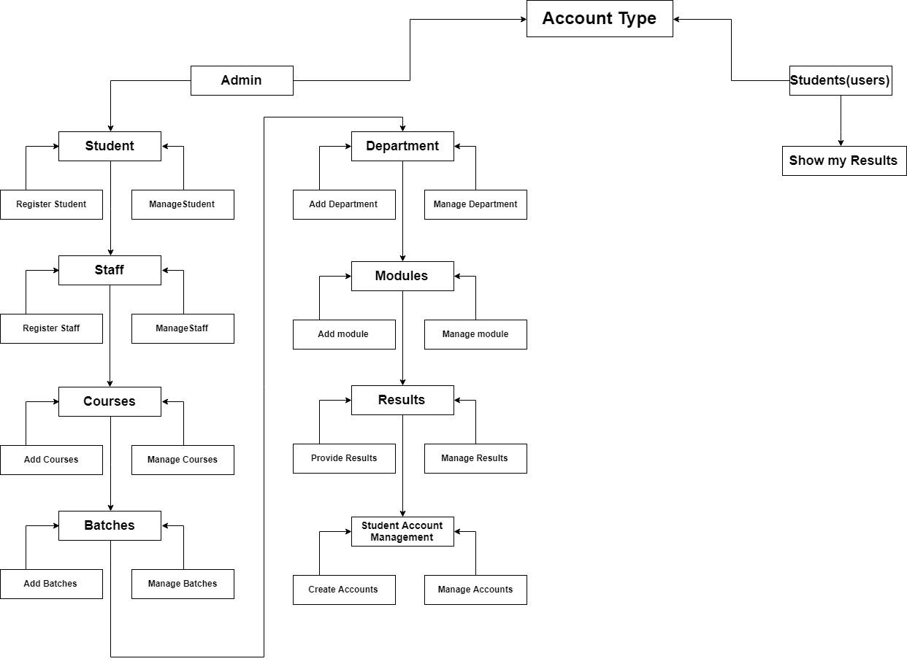
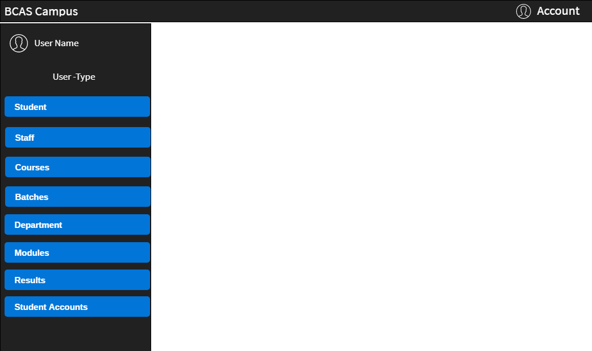
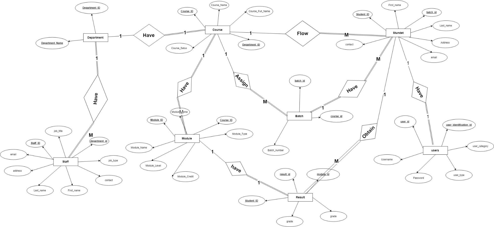
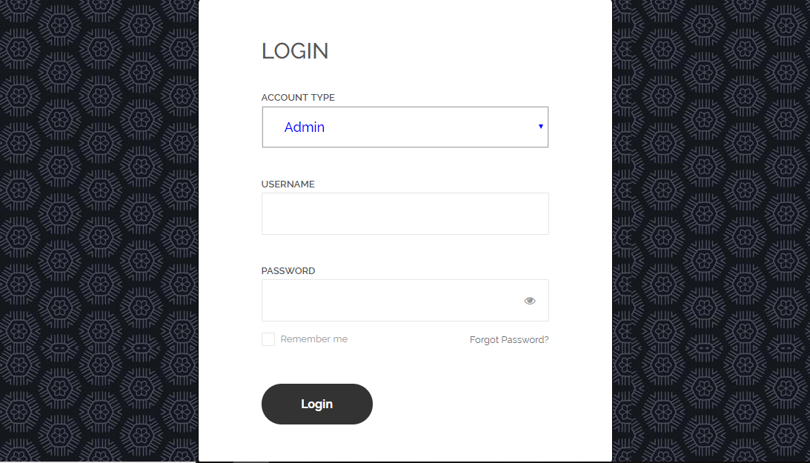
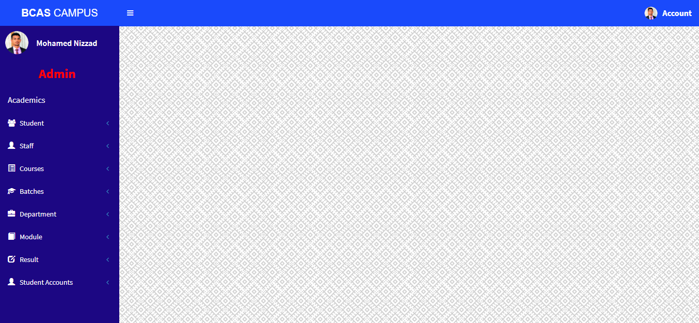
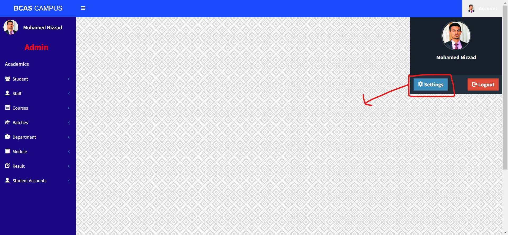
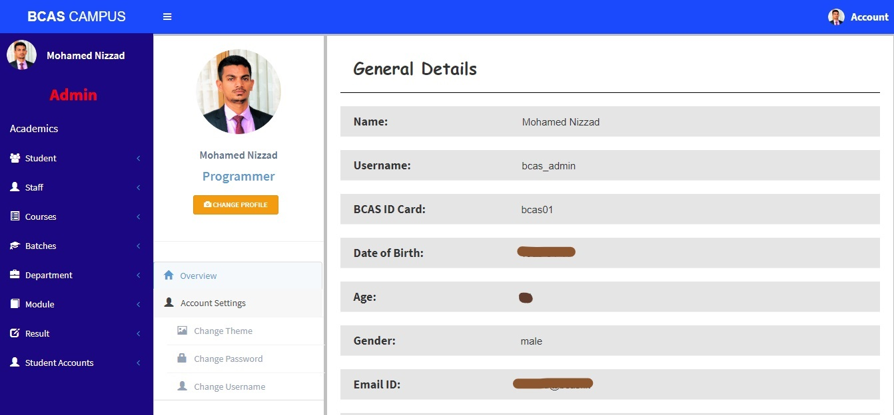
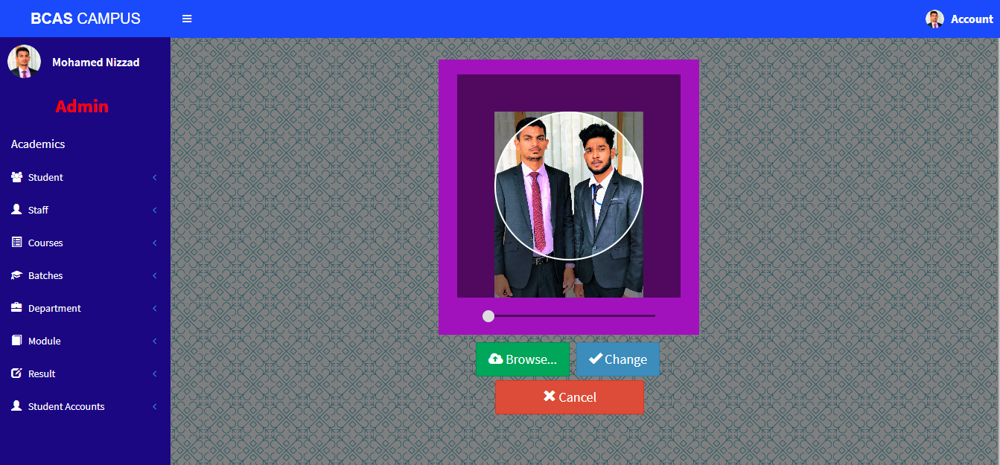

# E-BCAS

## Introduction

BRITISH COLLEGE OF APPLIED STUDIES (BCAS) is one of the vocational and tertiary providers in Sri Lanka in the field of private higher education since 1999.

The project E-BCAS aims to provide a web-based management solution to maintain the day-to-day operations and internal activities such as student management, result management and etc.

### System Structure

The following site map clearly explains the structure of the E-BCAS system. This system consists of two types of accounts, which are student accounts and admin accounts. The admin has the administrative permissions such as from registering students to creating student user accounts and etc.

### Wireframe

### ER-Diagram

### Features and Functionalities

**Admin Account**

- The admin account has all the privileges of the system.

- The admin has functionalities to register student, staff and manage details such as deleting, updating, changing password, username, profile picture and etc.

- The admin has privilege to manage course details such as add course, manage details and, CRUD functions.

- The admin has to have the permission to maintain the batch details such as organizing batch number, creating batches including CRUD functions.

- The admin has the department management module which can be used to manage the infrastructure of the organization.

- The admin has the functionalities to manage and organize subjects to the right corresponding courses.

- The admin should have the permission to manage results.

- The admin has the ability to create user accounts for students.

- The admin has a settings module which is used to manage its internal functions such as changing name, password, username, profile picture etc.

- The admin has the option to change its theme.

**Students Account**

- The student has a dashboard to view their results.

- The student account has a permission to change their password.

- The student has ability to change the profile picture.

- The student account has ability to change its theme.

## Technology and Frameworks

### Frontend

- HTML 5
- CSS 3
- JavaScript
- jQuery
- Bootstrap 4
- JSON
- AJAX

### Backend

- PHP 5.3.7
- CodeIgniter 3.1.9
- MySQL

### Other tools

- Composer

## Directory Structure

- **0-database** : Contains the database of the system.
- **1-soruce**   : Contains source code of the project.
- **2-selenium-testing-scripts**   : Contains testing scripts for the project.

- **github-readme-contents**   : Contains GitHub readme assets.

## Configuration & Setup

**Step 01:** The source code is found on the "1-source" directory, deploy it in a server.

**Step 02:** The database is found on the "0-database" folder, deploy it in a MySQL database engine Ex: phpMyAdmin.

## System Explained

### Login Page

This is the login page of this system, it has three text boxes, the first one indicates the account type, there are two types of accounts are available in this system, those are admin accounts and student accounts.

This login page has been developed with HTML 5, CSS 3, JavaScript and then some frameworks such as jQuery and Bootstrap.   

### Admin Account

This is the admin panel. It contain eight modules such as student, staff, courses, Batches, Department, Modules, Results, and Student Accounts.

The admin has an account setting module on the right side of the header bar that includes all the details of this system such as personal details, and credentials, the system's theme and etc. The admin can change the password, username, profile picture, and theme of the system.

### Admin Account Settings

This is the admin setting page. This page contains all information about the admin, here there are options to change password, username, theme, profile pictures, etc.

### Admin Profile Change

By clicking the change profile picture button on the setting page, it will be redirected to this page. Here, we can change the profile picture, it has a slider to adjust the profile picture size. If we click the browse button, that will let us select a profile picture from the local computer to upload.

## Web Testing Scripts Explained

## Social Media Links
